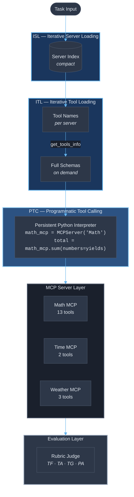
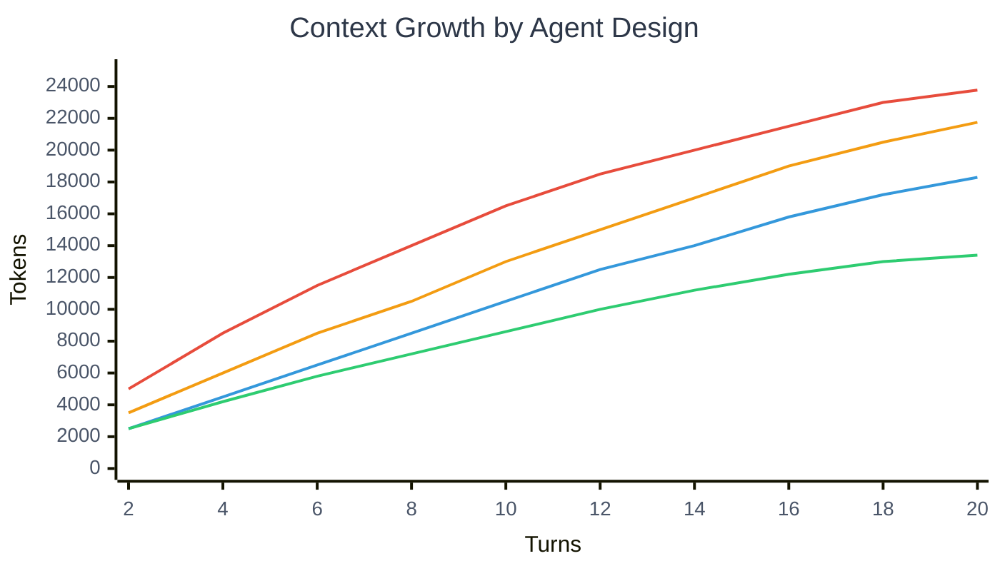

# ATLAS — Adaptive Tool Loading and Scoped Context

A reference implementation of the ATLAS framework from the Microsoft Research paper
[*"Scaling Agentic Capabilities, Not Context: Efficient Reinforcement Finetuning for Large Toolspaces"*](https://arxiv.org/abs/2603.06713) (arXiv:2603.06713, March 2026).

This repository aims to reproduce the paper's key finding:
**a 4B-parameter SLM can recover nearly 95% of a frontier 1T-parameter model's performance**
on MCP tool-use tasks by learning *what context to acquire* and *how to execute compactly*.

---

> ## Critical Observation: ATLAS Requires Reinforcement Finetuning — Off-the-Shelf SLMs Will Not Work
>
> **Before investing time in this demo, read this section.** The results you will observe
> with off-the-shelf SLMs (Phi-4-mini-instruct, Llama-3.2-3B, Ministral-3B, etc.) will
> **not** match the paper's claims. This is expected and explained below.
>
> ### The Economic Question: Is RL Training Worth It?
>
> The paper's RL training requires **8× NVIDIA B200 GPUs**, a 304-task training set, GPT-5
> for rubric generation, and a Qwen3-30B judge — an investment of **$10,000–$20,000+**.
> Meanwhile, current API pricing (April 2026) offers alternatives:
>
> | Model | Input $/1M tokens | Output $/1M tokens | RL Training Required? |
> |-------|-------------------|--------------------|-----------------------|
> | GPT-5-nano (Azure) | $0.05 | $0.40 | No — native tool calling |
> | GPT-4.1-nano (Azure) | $0.10 | $0.40 | No — native tool calling |
> | GPT-4.1-mini (Azure) | $0.40 | $1.60 | No — native tool calling |
> | GPT-4o-mini (Azure) | $0.15 | $0.60 | No — native tool calling |
> | Phi-4-mini (Azure Foundry) | ~$0.05–0.10 | ~$0.10–0.20 | **Yes** — for ATLAS benefits |
> | ATLAS-trained Qwen3-4B | Self-hosted | Self-hosted | **Yes** — 8× B200, ~$10K+ |
>
> The break-even point for ATLAS RL training investment is in the **millions of tasks per month** range.

  #### So why not use an LLM instead? 
Frontier LLMs "figure out" the right tools through three advantages that SLMs lack:

- Massive context windows (80K+ tokens) — They can afford to see all MCP tool schemas simultaneously without degradation. An SLM with 32K context can't.

- Scale-derived instruction following — A 1T-parameter model has seen enough training data to reason over novel JSON schemas, select relevant tools from a large set, and construct correct parameters. A 4B model hasn't internalized these patterns deeply enough.

- LLMs pay the token cost and don't care — They don't need to be efficient because it has the context budget to be wasteful. The entire point of ATLAS is that SLMs can't afford this.
>
> ### When ATLAS Training IS Justified
>
> - **Air-gapped / on-premise deployment** — Organizations that cannot use cloud APIs
>   (defense, healthcare, regulated finance) must run local models.
> - **Extreme scale** (>10M tasks/month) — Per-token savings compound at very high volumes.
> - **Edge / IoT deployment** — Latency-critical systems where cloud round-trips are
>   unacceptable.
> - **Research** — The rubric-based RFT methodology is genuinely novel and applicable
>   beyond ATLAS.
>
> ### When Using a Cheap LLM API Is Better
>
> - **Most enterprise deployments** — GPT-4.1-nano/GPT-5-nano via API is cheaper, requires
>   zero training, works out of the box with native tool calling, and handles MCP server
>   changes without retraining.
> - **Rapidly evolving tool ecosystems** — ATLAS was trained on 28 specific MCP servers.
>   When servers change APIs or new servers appear, the model may need retraining.
> - **Teams without ML infrastructure** — The RL pipeline requires GPU clusters, MLOps
>   expertise, and ongoing maintenance.
>
> ### Bottom Line
>
> **ATLAS is a reinforcement finetuning framework, not an inference-time architecture.**
> The ISL/ITL/PTC components are the *substrate for learning*, not standalone
> optimizations. Running this demo with off-the-shelf SLMs demonstrates *why* the training
> is necessary — the architecture alone is actively counterproductive on untrained models.
>
---

## Table of Contents

- [Critical Observation: Off-the-Shelf SLMs Will Not Work](#️-critical-observation-atlas-requires-reinforcement-finetuning--off-the-shelf-slms-will-not-work)
- [What Is ATLAS?](#what-is-atlas)
- [The Problem It Solves](#the-problem-it-solves)
- [How ATLAS Works](#how-atlas-works)
- [Architecture Diagram](#architecture-diagram)
- [Codebase Overview](#codebase-overview)
- [MCP Servers](#mcp-servers)
- [Agents](#agents)
- [Evaluation System](#evaluation-system)
- [Models](#models)
- [Results from the Paper](#results-from-the-paper)
- [Running the Demo](#running-the-demo)
- [Next Steps and Future of ATLAS](#next-steps-and-future-of-atlas)
- [References](#references)

---

## What Is ATLAS?

ATLAS (**A**daptive **T**ool **L**oading **a**nd **S**coped Context) is a reinforcement finetuning
(RFT) framework from [Microsoft Research](https://arxiv.org/abs/2603.06713) that enables
**Small Language Models (SLMs)** to operate effectively in large-scale
[Model Context Protocol (MCP)](https://modelcontextprotocol.io/specification/) environments.

ATLAS is built around two core abstractions:

1. **Adaptive Tool Loading** — Exposes a compact capability overview and incrementally
   materializes detailed tool schemas only when required, bounding context growth at each
   step while supporting multi-server workflows.
2. **Orchestration Through Code** — Represents long-horizon tool use as executable programs
   rather than turn-by-turn natural language interactions, keeping intermediate state out
   of the prompt while preserving explicit control flow.

These behaviors are learned end-to-end through reinforcement finetuning using
**rubric-based rewards**, rather than fixed architectural choices.

---

## The Problem It Solves

Modern agentic systems operate over the
[Model Context Protocol (MCP)](https://www.anthropic.com/news/model-context-protocol),
where a single user request may require coordinated planning across multiple external
services and tools. MCP was introduced by Anthropic in November 2024 as a standardized
protocol for LLM-tool interaction using JSON-RPC 2.0 messages between hosts, clients, and
servers ([MCP Specification](https://modelcontextprotocol.io/specification/)).

The core challenge is **decision-making at scale**: agents are often connected to hundreds
of tools across many MCP servers, and exposing the full tool registry upfront forces
reasoning over large, heterogeneous schemas. This is especially problematic for SLMs
because:

| Challenge | Impact on SLMs |
|-----------|---------------|
| **Tool-space explosion** | Loading all tool schemas (e.g., 257 tools across 28 servers in [MCPBench](https://arxiv.org/abs/2508.20453)) saturates tight context windows |
| **Long-horizon execution** | Early errors compound over time when limited context restricts stable state tracking |
| **Weak supervision** | MCP tasks rarely admit a single verifiable outcome, making outcome-only rewards too sparse for credit assignment |
| **Code synthesis brittleness** | SLMs struggle with code-based orchestration over out-of-distribution MCP tool libraries |


---

## How ATLAS Works

ATLAS introduces four progressive mechanisms, each building on the previous one:

### 1. Iterative Server Loading (ISL) — Section 2.1

Instead of loading all tool schemas upfront, the agent starts with a **compact index** of
available MCP servers (just names and short descriptions). It selects one server at a time
based on the task, materializes only that server's tools, and loads additional servers
incrementally as needed.

> *"This staged exposure avoids eager loading across all servers, preserves context for
> execution-critical information, and bounds tool selection to a single server at a time."*
> — [arXiv:2603.06713, Section 2.1](https://arxiv.org/html/2603.06713v1)

### 2. Iterative Tool Loading (ITL) — Section 2.2

Upon loading a server, the agent initially sees only **tool names** (a lightweight list).
It then selectively materializes full schemas — including argument types, descriptions,
and output examples — only for the specific tools needed at each decision point.

> *"By deferring full tool loading until use, ITL preserves context for execution-critical
> information while enabling scalable reasoning over large and heterogeneous tool
> collections."*
> — [arXiv:2603.06713, Section 2.2](https://arxiv.org/html/2603.06713v1)

### 3. Programmatic Tool Calling (PTC) — Section 2.3

ATLAS replaces JSON-style turn-by-turn tool calling with a **persistent Python
interpreter**. Tool calls are expressed as function invocations, control flow is encoded
explicitly using programming constructs, and intermediate results are stored in program
state rather than surfaced to the model.

> *"The interpreter serves as a unified orchestration layer across MCP servers, with
> execution proceeding via synthesis and refinement of a single program."*
> — [arXiv:2603.06713, Section 2.3](https://arxiv.org/html/2603.06713v1)

### 4. Rubric-Based Reinforcement Finetuning (RFT) — Section 3.1

Instead of generic trajectory-level scores, ATLAS decomposes task success into
**structured, task-aligned rubric criteria** across four categories:

| Category | Weight | What It Measures |
|----------|--------|-----------------|
| **Task Fulfillment (TF)** | 0.40 | Whether core task requirements are satisfied |
| **Tool Appropriateness (TA)** | 0.30 | Whether selected tools are relevant and necessary |
| **Tool Grounding (TG)** | 0.20 | Whether tool outputs are used faithfully |
| **Parameter Accuracy (PA)** | 0.10 | Correctness of tool arguments |

Each rubric criterion $C_i$ with weight $W_i$ is scored per category $R$:

$$S_R(\tau) = \frac{\sum_{i=1}^{N_R} W_i \cdot d_i(\tau)}{\sum_{i=1}^{N_R} W_i}$$

where $d_i(\tau) \in [0,1]$ is the score for criterion $C_i$ on trajectory $\tau$.

**Breaking this down:**

- **Rubric criterion $C_i$** — A single, concrete evaluation question such as *"Does the
  agent compute all required statistics (total, average, median, mode, min, max, range)?"*
  Each task gets 12 such criteria (5 TF + 3 TA + 2 TG + 2 PA), auto-generated once per
  task by GPT-5 and held fixed during training
  ([Appendix F.1](https://arxiv.org/html/2603.06713v1)).
- **Weight $W_i$** — An importance score (1–10) assigned to each criterion. E.g.,
  *"Statistical completeness"* might get $W_i = 10$ (critical), while *"output
  formatting"* might get $W_i = 4$ (moderate).
- **Score $d_i(\tau)$** — The LLM judge's verdict on how well criterion $C_i$ was
  satisfied in trajectory $\tau$, scored 0–1. E.g., $d_i = 0.9$ means 90% satisfied.
- **$S_R(\tau)$** — The **weighted average satisfaction** for category $R$ (e.g., Task
  Fulfillment). It's a normalized score that gives more influence to high-weight criteria
  within that category.
- **Final reward** — The category scores are combined with inter-category weights
  ($0.40 \cdot S_{TF} + 0.30 \cdot S_{TA} + 0.20 \cdot S_{TG} + 0.10 \cdot S_{PA}$)
  to produce the training reward for GRPO.

**Why 12 specific criteria instead of one holistic score?** Generic judges produce noisy,
inconsistent rewards on long MCP trajectories. By decomposing evaluation into concrete,
task-specific questions, rubric-based scoring (1) enables SLM judges like Qwen3-30B to
**outperform frontier judges** like GPT-4o, (2) **reduces variance** in reward signals
since criteria are held constant across all trajectories for a task, and (3) provides
**fine-grained credit assignment** — the model learns *which behaviors* matter, not just
whether the overall trajectory succeeded
([Section 3.1](https://arxiv.org/html/2603.06713v1)).

**Concrete example** (from the farm report task in [rubrics.py](evaluation/rubrics.py)):

| $C_i$ (Criterion) | Category | $W_i$ | What the judge checks |
|--------------------|----------|--------|----------------------|
| Statistical completeness | TF | 10 | All stats computed (total, avg, median, mode, min, max, range) |
| Revenue calculation | TF | 9 | Correct revenue at $30/ton from total output |
| Correct tool selection | TA | 8 | Used `sum`, `mean`, `median`, `mode` — not manual arithmetic |
| Tool output fidelity | TG | 7 | Agent reports values from tool outputs, not hallucinated numbers |
| Argument correctness | PA | 6 | Passed yield array `[120, 150, ...]` to the right parameter names |

The RL training uses **GRPO (Group Relative Policy Optimization)**, a critic-free RL
algorithm introduced by DeepSeek
([arXiv:2501.12948](https://arxiv.org/abs/2501.12948)) that estimates advantages relative
to a group of sampled responses, eliminating the need for a separate value model.

---

## Architecture Diagram



### Context Growth Comparison

*Figure 1 from the paper — context token usage across turns for each agent variant:*



| Color | Agent Variant | Final Tokens (Turn 20) |
|-------|---------------|------------------------|
| 🔴 Red | Naive — all tools loaded upfront | ~23,768 |
| 🟠 Orange | ISL — iterative server loading | ~21,747 |
| 🔵 Blue | ITL — iterative tool loading | ~18,290 |
| 🟢 Green | ATLAS (ITL + PTC) — full framework | ~13,400 |

Traditional MCP agents incur high context costs by loading all tools upfront. ISL and ITL
progressively reduce context by scoping server and tool schemas, while ITL+PTC (ATLAS)
further minimizes prompt growth by moving execution state into programmatic orchestration.
([arXiv:2603.06713, Figure 1](https://arxiv.org/html/2603.06713v1)).

---

## Codebase Overview

```
ATLAS/
├── demo.py                    # Main comparison runner (Table 1 + Figure 1)
├── requirements.txt           # Core deps: openai, tiktoken, tabulate
├── .devcontainer/
│   └── devcontainer.json      # Dev container config (Python 3.12)
├── servers/                   # Mock MCP servers
│   ├── __init__.py            # ALL_SERVERS registry
│   ├── math_server.py         # Math MCP — 13 tools (add, subtract, ..., round)
│   ├── time_server.py         # Time MCP — 2 tools (get_current_time, convert_time)
│   └── weather_server.py      # Weather MCP — 3 tools (forecast, alerts, historical)
├── core/                      # ATLAS infrastructure
│   ├── __init__.py
│   ├── mcp_server.py          # MCPServer abstraction (Appendix A.2)
│   ├── server_registry.py     # ISL & ITL implementation (Sections 2.1–2.2)
│   ├── code_executor.py       # PTC persistent interpreter (Section 2.3)
│   └── token_counter.py       # tiktoken-based measurement
├── agents/                    # 4 agent variants
│   ├── __init__.py
│   ├── base_agent.py          # Shared: LLM calling, token tracking, trajectory
│   ├── naive_agent.py         # Baseline — all tools loaded upfront
│   ├── isl_agent.py           # ISL agent (Section 2.1)
│   ├── itl_agent.py           # ISL + ITL agent (Section 2.2)
│   └── atlas_agent.py         # Full ATLAS: ISL + ITL + PTC (Sections 2.1–2.3)
└── evaluation/                # Rubric-based evaluation (Section 3.1)
    ├── __init__.py
    ├── rubrics.py             # Rubric data structures + task-specific rubric builders
    └── rubric_judge.py        # LLM judge with rubric-based and generic scoring
```

### MCP Servers

Three mock MCP servers simulate the real MCP server ecosystem used in the paper. The ATLAS
paper evaluated on [MCPBench](https://arxiv.org/abs/2508.20453), which consists of
**28 MCP servers exposing 257 tools** spanning search, scientific computing, finance,
health, and knowledge retrieval.

| Server | Tools | Description | Paper Reference |
|--------|-------|-------------|-----------------|
| **Math MCP** | 13 | add, subtract, multiply, division, sum, mean, median, mode, min, max, floor, ceiling, round | MCPBench server list ([arXiv:2603.06713, Appendix D.1](https://arxiv.org/html/2603.06713v1)) |
| **Time MCP** | 2 | get_current_time, convert_time | MCPBench server list |
| **Weather MCP** | 3 | get_forecast, get_alerts, get_historical_temp | Multi-server orchestration demo |

Each server exposes a static `execute(tool_name, args)` dispatcher that mirrors the
behavior of real MCP server JSON-RPC calls.

### Agents

Four agent variants are implemented, corresponding to configurations from Table 1 of the
paper:

| Agent | Paper Row | Mechanisms | Description |
|-------|-----------|------------|-------------|
| **NaiveAgent** | Row 1 pattern | All Tools Loaded | Baseline: loads all tool schemas into the system prompt upfront. This is how most MCP agents work today. |
| **ISLAgent** | Row 9 | ISL | Starts with a compact server index; selects one server at a time via `fetch_tools` action |
| **ITLAgent** | Row 14 | ISL + ITL | Adds `get_tool_info` action: server loading returns only tool names; full schemas materialized selectively |
| **ATLASAgent** | Row 19 | ISL + ITL + PTC | Full ATLAS: uses `CodeExecutor` (persistent Python interpreter) for programmatic tool orchestration |

All agents share a common base (`BaseAgent`) that tracks cumulative tokens, turn counts,
and token history for Figure 1-style context growth visualization.

### Evaluation System

The evaluation system implements the paper's rubric-based scoring framework:

- **`rubrics.py`** — Defines `RubricCriterion` dataclass and two task-specific rubric
  builders, each producing **12 criteria in a 5+3+2+2 distribution** across TF/TA/TG/PA
  categories. This matches the rubric generation prompt in Appendix F.1:
  *"Always return a list of JSON objects with 12 rubrics out of which follow the below
  distribution: 5 rubrics for Task Fulfillment and Quality, 3 rubrics for Tool
  Appropriateness, 2 rubrics for Tool Grounding, 2 rubrics for Parameter Accuracy."*

- **`rubric_judge.py`** — Implements both rubric-based scoring
  ($S_R(\tau) = \sum W_i \cdot d_i(\tau) / \sum W_i$) and generic trajectory-level
  scoring for comparison. The judge prompts are adapted from Appendix F.2 (rubric eval)
  and F.3 (base judge).

### Models

This demo supports three model providers via the
[OpenAI Python SDK](https://github.com/openai/openai-python) (≥1.30), which provides a
universal client compatible with OpenAI, Ollama, and Azure AI Foundry endpoints:

#### Azure AI Foundry (Recommended — No Local Downloads)

The following SLMs are available as serverless API deployments on
[Azure AI Foundry](https://ai.azure.com/), covering three vendors across the 3–14B range
that matches the ATLAS paper's focus on small language models:

| Model | Parameters | Context | Vendor | Foundry Deployment Name | Why Test It |
|-------|------------|---------|--------|------------------------|-------------|
| **Phi-4-mini-instruct** | 3.8B | 128K | Microsoft | `Phi-4-mini-instruct` | Closest to Qwen3-4B (3.8B params), built-in function calling, MIT license ([Microsoft Blog](https://azure.microsoft.com/en-us/blog/one-year-of-phi-small-language-models-making-big-leaps-in-ai/)). |
| **Ministral-3B** | 3B | 128K | Mistral AI | `Ministral-3B` | Mistral's smallest model, edge-optimized. Tests whether a non-Microsoft 3B SLM can handle ATLAS's ISL/ITL/PTC pipeline. Available for fine-tuning on Foundry ([Mistral docs](https://docs.mistral.ai/getting-started/models/premier/#ministral-3b)). |
| **Llama-3.2-3B-Instruct** | 3.2B | 128K | Meta | `Llama-3.2-3B-Instruct` | Meta's agentic SLM with built-in tool-use training. The [Llama 3.2 release](https://ai.meta.com/blog/llama-3-2-connect-2024-vision-edge-mobile-devices/) specifically targets on-device agentic use cases, making it a natural ATLAS candidate. |
| **Phi-4** | 14B | 16K | Microsoft | `Phi-4` | 3.5× the paper's parameter budget — tests the upper SLM boundary. The paper evaluated Qwen2.5-7B-Instruct ([Section 4.2](https://arxiv.org/html/2603.06713v1)); Phi-4 fills the mid-size comparison slot. Released Dec 2024 ([arXiv:2412.08905](https://arxiv.org/abs/2412.08905)). |

All four models are available as serverless APIs in East US, East US 2, North Central US,
South Central US, Sweden Central, West US, and West US 3
([Region availability](https://learn.microsoft.com/azure/foundry-classic/how-to/deploy-models-serverless-availability)).

> **Note:** Qwen3-4B (the paper's primary model) is **not** available on Azure AI Foundry.
> Phi-4-mini-instruct is the closest match in size and capability. For Qwen3-4B, use
> Ollama locally (see [Local Inference with Ollama](#local-inference-with-ollama-optional)).

#### OpenAI API

| Model | Provider | How to Run |
|-------|----------|------------|
| **GPT-4o-mini** | OpenAI API | Comparison baseline via `OPENAI_API_KEY` |

#### Local with Ollama (Optional)

| Model | Parameters | How to Run |
|-------|------------|------------|
| **Qwen3-4B** | 4B | `ollama pull qwen3:4b` — The primary model from the ATLAS paper ([arXiv:2505.09388](https://arxiv.org/abs/2505.09388)) |
| **Phi-4-mini** | 3.8B | `ollama pull phi4-mini:latest` — Same as Azure-hosted version, for offline use |

The paper also uses **Kimi K2 Thinking** (1T parameters, 80K context) by Moonshot AI
([arXiv:2507.20534](https://arxiv.org/abs/2507.20534)) as the frontier baseline
(TF 4.38/10 on MCPBench).

---

## Results from the Paper

### Table 1: Performance on MCPBench

The following table reproduces key rows from Table 1 of the paper. Task Fulfillment (TF)
is scored on a 0–10 scale by an o4-mini LLM judge.

| # | Model | Variant | TF (0–10) | Avg Turns | Avg Tokens |
|---|-------|---------|-----------|-----------|------------|
| 1 | Kimi-K2 Thinking (1T) | All Tools Loaded | **4.38** | 20 | 23,768 |
| 2 | Kimi-K2 Thinking | ISL | 4.11 | 27 | 21,747 |
| 3 | Kimi-K2 Thinking | ITL | 3.62 | 28 | 18,290 |
| 9 | Qwen3-4B | ISL (no learning) | 2.73 | 24 | 9,152 |
| 13 | Qwen3-4B | ISL + RL w/ Rubrics (SLM Judge) | 3.87 | 19 | 11,142 |
| 14 | Qwen3-4B | ITL (no learning) | 2.36 | 20 | 9,045 |
| 15 | Qwen3-4B | ITL + PTC (no learning) | 2.94 | 18 | 13,462 |
| 17 | Qwen3-4B | ITL + PTC + RL (Generic, SLM Judge) | 3.91 | 20 | 12,951 |
| 18 | Qwen3-4B | ITL + RL w/ Rubrics (SLM Judge) | 4.03 | 20 | 11,151 |
| **19** | **Qwen3-4B** | **ITL + PTC + RL w/ Rubrics (SLM Judge)** | **4.15** | **18** | **13,400** |

> Source: [arXiv:2603.06713, Table 1](https://arxiv.org/html/2603.06713v1)

### Key Findings

1. **Structure alone is insufficient.** Without learning, ITL yields ~10% gains, while
   PTC delivers ~25% improvements by stabilizing execution
   ([Section 5.2](https://arxiv.org/html/2603.06713v1)).

2. **Reinforcement finetuning delivers the largest gains (+35–65%).** ITL+PTC provides the
   strongest execution substrate for learning
   ([Section 5.3](https://arxiv.org/html/2603.06713v1)).

3. **Rubric-based supervision improves task success by up to 20%** and allows SLM judges
   (Qwen3-30B-Instruct) to outperform frontier judges (GPT-4o)
   ([Section 5.4](https://arxiv.org/html/2603.06713v1)).

4. **A 4B SLM recovers nearly 95% of the frontier 1T model's performance**
   (TF 4.15 vs. 4.38) under far tighter parameter and context budgets
   ([Section 5.5](https://arxiv.org/html/2603.06713v1)).

### Training Configuration

The paper trains with GRPO using the [verl](https://github.com/verl-project/verl)
(Volcano Engine RL) library on 8× NVIDIA B200 GPUs:

| Hyperparameter | Value |
|----------------|-------|
| Train batch size | 16 |
| PPO mini-batch size | 4 |
| Max context window | 31,000 |
| Rollout samples (n) | 4 |
| Rollout temperature | 1.0 |
| Advantage estimator | GRPO |
| Learning rate | 1×10⁻⁶ |
| Optimizer | AdamW |
| Precision | bfloat16 |
| Max tool calls | 20 |
| Max tool response length | 4,000 |
| KL loss coefficient | 0.001 |

> Source: [arXiv:2603.06713, Appendix B, Table 2](https://arxiv.org/html/2603.06713v1)

---

## Running the Demo

### Prerequisites

- Python 3.10+
- An [Azure AI Foundry](https://ai.azure.com/) account with serverless API deployments
  **or** an [OpenAI API key](https://platform.openai.com/api-keys)
  **or** [Ollama](https://ollama.com/) installed locally

### Setup

```bash
# Clone and install dependencies
cd ATLAS
pip install -r requirements.txt
```

### Run

```bash
# Azure AI Foundry — Phi-4-mini-instruct (recommended, no local downloads)
python demo.py --provider azure --model Phi-4-mini-instruct --task farm --agents all

# Azure AI Foundry — compare multiple SLMs
python demo.py --provider azure --model Ministral-3B --task farm --agents all
python demo.py --provider azure --model Llama-3.2-3B-Instruct --task farm --agents all
python demo.py --provider azure --model Phi-4 --task farm --agents all

# OpenAI API baseline
python demo.py --provider openai --model gpt-4o-mini --task farm --agents all

# Local Ollama (requires Ollama installed separately)
python demo.py --provider ollama --model qwen3:4b --task farm --agents all

# Skip judge evaluation (faster, metrics only)
python demo.py --provider azure --model Phi-4-mini-instruct --task farm --agents all --skip-judge
```

### Azure AI Foundry Setup (Recommended)

The dev container is configured for **Azure AI Foundry serverless APIs** out of the box.
No local model downloads or GPU required — models run on Microsoft-managed infrastructure
with pay-per-token billing.

**Available SLMs for testing** (all support chat completions via the Azure OpenAI API):

| Model | Params | Vendor | Deployment Name |
|-------|--------|--------|-----------------|
| Phi-4-mini-instruct | 3.8B | Microsoft | `Phi-4-mini-instruct` |
| Ministral-3B | 3B | Mistral AI | `Ministral-3B` |
| Llama-3.2-3B-Instruct | 3.2B | Meta | `Llama-3.2-3B-Instruct` |
| Phi-4 | 14B | Microsoft | `Phi-4` |

**Setup steps:**

1. Go to [Azure AI Foundry portal](https://ai.azure.com/) → **Model catalog**
2. Deploy one or more models using **Serverless API** deployment type
3. Copy the **endpoint URL** and **API key** from the deployment's
   **Keys and Endpoint** page
4. Create a `.env` file in the project root (use the template):
   ```bash
   cp .env.example .env
   ```
   Then edit `.env` with your credentials:
   ```env
   AZURE_ENDPOINT=https://your-resource.services.ai.azure.com
   AZURE_API_KEY=your-api-key-here
   ```
   The `.env` file is git-ignored and loaded automatically by the demo.
5. Run the demo — the `--model` value must match your **deployment name** in Foundry:
   ```bash
   python demo.py --provider azure --model Phi-4-mini-instruct --task farm --agents all
   ```

> **Tip:** You can deploy multiple models and compare them back-to-back. Each deployment
> gets its own name within the same Foundry resource, and they share the same endpoint URL.
> The `--model` flag selects which deployment to use.

### Dev Container

A [dev container](.devcontainer/devcontainer.json) config is included for VS Code:

1. Copy `.env.example` to `.env` and fill in your Azure credentials
2. Open the command palette → **Dev Containers: Reopen in Container**
3. Python 3.12 + all pip dependencies (including `python-dotenv`) are installed automatically
4. No local GPU or model downloads required — connect directly to Azure AI Foundry

After the container starts:

```bash
python demo.py --provider azure --model Phi-4-mini-instruct --task farm --agents all
```

### Local Inference with Ollama (Optional)

If you prefer to run models locally (e.g., for the paper's primary Qwen3-4B model which
is not on Azure AI Foundry), install Ollama separately:

```bash
# Install Ollama (Linux / macOS)
curl -fsSL https://ollama.com/install.sh | sh

# Start the Ollama server
ollama serve &

# Pull a model
ollama pull qwen3:4b

# Run the demo locally
python demo.py --provider ollama --model qwen3:4b --task farm --agents all
```

> **Note:** Ollama is **not** pre-installed in the dev container. The container is
> optimized for cloud-based inference via Azure AI Foundry. To use Ollama inside the
> container, run:
> `sudo apt-get update -qq && sudo apt-get install -y -qq zstd && curl -fsSL https://ollama.com/install.sh | sh`

### Expected Output

The demo produces:
- **Table 1-style comparison** of all 4 agent variants (TF, Turns, Tokens)
- **Figure 1-style ASCII chart** showing context growth across agent designs
- **Ground-truth validation** of computed values against expected results
- **Rubric-based vs. generic judge** score comparison (when `--skip-judge` is not set)

---

## Next Steps and Future of ATLAS

### Directions from the Paper

The ATLAS paper identifies several natural extensions:

1. **Rubric-based rewards for PTC.** The paper notes: *"While we do not yet apply
   rubric-based rewards to PTC, due to the challenge of defining concrete rubrics over
   executable code"* ([Section 5.3](https://arxiv.org/html/2603.06713v1)). Developing
   rubrics for code-based orchestration could push TF beyond 4.15.

2. **Scaling to larger tool ecosystems.** The paper evaluated on 28 MCPBench servers
   (257 tools) plus 11 ATLAS-Test servers (57+ tools). Real enterprise deployments may
   involve hundreds of servers with thousands of tools. The
   [MCPVerse benchmark](https://arxiv.org/abs/2508.20453) already expands to 65 MCP
   servers with 552+ tools.

3. **SLM judge improvement.** The paper shows that a Qwen3-30B SLM judge with rubrics
   outperforms GPT-4o with generic scoring. Further distillation could produce even
   smaller judges (e.g., 7B–14B) for cost-efficient training at scale.

4. **Cross-domain generalization.** The ATLAS-Test evaluation on 11 unseen servers
   demonstrates initial OOD generalization. Extensions include continuously evolving
   server ecosystems and dynamic tool deprecation/addition.

### Extensions for This Implementation

Potential extensions include:

- **Live MCP server integration** — Replace mock servers with real MCP servers via the
  [MCP Python SDK](https://github.com/modelcontextprotocol/python-sdk)
- **RL training loop** — Integrate with
  [verl](https://github.com/verl-project/verl) to reproduce the full GRPO training
  pipeline
- **Additional SLMs** — Test with Ministral-3B, Llama-3.2-3B, or Phi-4 on
  Azure AI Foundry to compare cross-vendor SLM performance on ATLAS architectures
- **Visualization** — Generate matplotlib plots for Figure 1 (context growth) and
  Figure 3 (training curves)
- **Benchmarking** — Expand to the full MCPBench 104-task evaluation set

---

## References

| Reference | Link |
|-----------|------|
| ATLAS paper | [arXiv:2603.06713](https://arxiv.org/abs/2603.06713) |
| MCPBench (MCP-Bench) | [arXiv:2508.20453](https://arxiv.org/abs/2508.20453) |
| Model Context Protocol specification | [modelcontextprotocol.io](https://modelcontextprotocol.io/specification/) |
| MCP announcement (Anthropic, Nov 2024) | [anthropic.com](https://www.anthropic.com/news/model-context-protocol) |
| Qwen3 Technical Report | [arXiv:2505.09388](https://arxiv.org/abs/2505.09388) |
| Qwen2.5 Technical Report | [arXiv:2412.15115](https://arxiv.org/abs/2412.15115) |
| Phi-4 paper | [arXiv:2412.08905](https://arxiv.org/abs/2412.08905) |
| Microsoft Phi-4-mini blog | [azure.microsoft.com](https://azure.microsoft.com/en-us/blog/one-year-of-phi-small-language-models-making-big-leaps-in-ai/) |
| Kimi K2 paper | [arXiv:2507.20534](https://arxiv.org/abs/2507.20534) |
| DeepSeek-R1 (GRPO) | [arXiv:2501.12948](https://arxiv.org/abs/2501.12948) |
| verl RL library | [github.com/verl-project/verl](https://github.com/verl-project/verl) |
| Programmatic Tool Calling (Anthropic) | [anthropic.com/engineering](https://www.anthropic.com/engineering/code-execution-with-mcp) |
| OpenAI Python SDK | [github.com/openai/openai-python](https://github.com/openai/openai-python) |
| MCP Tool Descriptions study | [arXiv:2602.14878](https://arxiv.org/abs/2602.14878) |


---

## License

This is a research reference implementation. The ATLAS paper is published under
[CC BY 4.0](https://creativecommons.org/licenses/by/4.0/).
